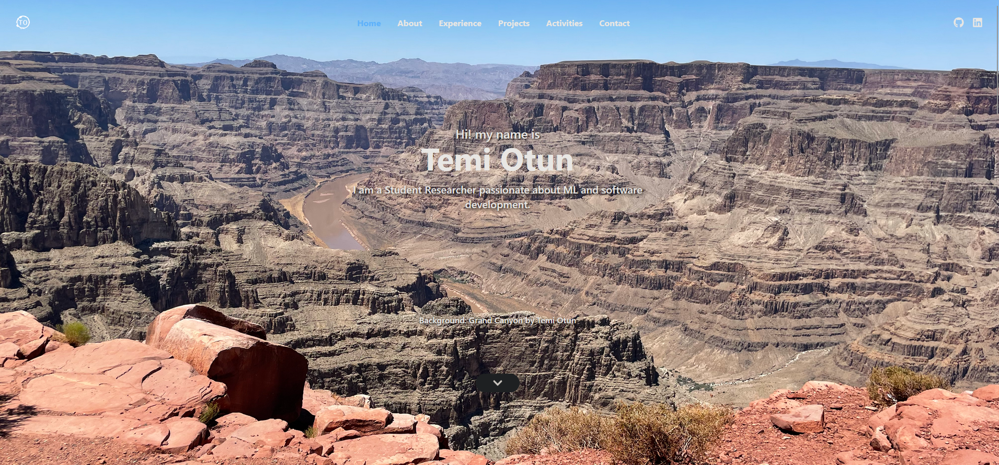

# Temi Otun - Personal Portfolio Website 🚀

A modern, responsive personal portfolio website showcasing my research in deep learning, machine learning projects, and technical expertise. Built with React.js, featuring smooth animations, interactive 3D backgrounds, and a clean, professional design.



## 🌟 Live Demo

Visit the live website: [Portfolio Website](https://portfolio-te9i.onrender.com)

## 📋 Table of Contents

- [About](#about)
- [Features](#features)
- [Tech Stack](#tech-stack)
- [Projects Showcase](#projects-showcase)
- [Getting Started](#getting-started)
- [Installation](#installation)
- [Usage](#usage)
- [Deployment](#deployment)
- [Contact](#contact)

## 🎯 About

This portfolio website serves as a comprehensive showcase of my journey as a researcher and developer, specializing in:

- **Deep Learning Research**: Multimodal deep learning models integrating physiological signals, text, and image data
- **Machine Learning Projects**: Healthcare applications, emotion detection, and predictive modeling
- **Web Development**: Modern React applications with responsive design
- **Data Analysis**: Working with large datasets and implementing various ML algorithms

## ✨ Features

- **Responsive Design**: Optimized for all devices and screen sizes
- **Interactive 3D Background**: Powered by Three.js and Vanta.js for stunning visual effects
- **Smooth Animations**: Framer Motion animations for enhanced user experience
- **Scroll Spy Navigation**: Dynamic navigation highlighting current section
- **Contact Form**: Functional contact form with backend integration
- **Project Showcase**: Detailed presentation of research and development projects
- **Resume Integration**: Direct access to downloadable resume
- **Social Media Links**: Quick access to GitHub and LinkedIn profiles

## 🛠️ Tech Stack

### Frontend
- **React.js** - Component-based UI framework
- **JavaScript (ES6+)** - Core programming language
- **CSS3** - Styling and responsive design
- **Framer Motion** - Animation library
- **React Icons** - Icon components
- **React Scroll** - Smooth scrolling functionality
- **React Scrollspy** - Navigation highlighting

### Backend & APIs
- **Node.js** - Runtime environment
- **Express.js** - Web application framework
- **Nodemailer** - Email functionality
- **Axios** - HTTP client for API calls

### 3D Graphics & Animation
- **Three.js** - 3D graphics library
- **Vanta.js** - Animated backgrounds

### Development Tools
- **Create React App** - Development environment
- **npm** - Package management

## 🔬 Projects Showcase

### 1. ECG Research
**Multimodal Deep Learning for Healthcare**
- Research on integrating physiological signals, text, and image data
- Applications in various downstream healthcare tasks
- Cutting-edge deep learning methodologies

### 2. Alzheimer's Speech Research
**Early Detection of Cognitive Impairment**
- Audio dataset analysis for dementia and MCI classification
- Part of ICASSP 2025 SPGC challenge
- Self-supervised learning and pre-trained model integration
- Achieved significant improvements in F1 score, recall, and RMSE

### 3. Lung Cancer Detection
**Machine Learning for Medical Diagnosis**
- Evaluated 7 ML algorithms on lung cancer dataset
- Best performance: Support Vector Machine
- **Results**: 99% Recall, 94% Accuracy, 95% Precision, 97% F1 Score
- [View Project](https://colab.research.google.com/gist/temii70/b300e9ca79168cc0b1c82c9110a06e56/models.ipynb)

### 4. Emotion Detection System
**Real-time Computer Vision**
- Convolutional Neural Network built with TensorFlow
- OpenCV integration for real-time emotion recognition
- Live camera feed processing

### 5. NBA Chatbot
**Data-Driven Sports Analytics**
- Python-based basketball information system
- Kaggle SQL database integration (4,800+ NBA players, 30 teams)
- Technologies: Swift, SQL, Python
- [View on GitHub](https://github.com/temii70/NBAChatbot)

## 🚀 Getting Started

### Prerequisites

- Node.js (v14 or higher)
- npm or yarn package manager
- Git

### Installation

1. **Clone the repository**
   ```bash
   git clone https://github.com/temii70/portfolio.git
   cd portfolio
   ```

2. **Install dependencies**
   ```bash
   npm install
   ```

3. **Install backend dependencies**
   ```bash
   cd backend
   npm install
   cd ..
   ```

4. **Set up environment variables**
   
   Create a `.env` file in the `src` directory and add your configuration:
   ```env
   REACT_APP_API_URL=your_backend_url
   EMAIL_USER=your_email
   EMAIL_PASS=your_email_password
   ```

## 💻 Usage

### Development Mode

Start the development server:
```bash
npm start
```

The application will open at [http://localhost:3000](http://localhost:3000)

### Backend Server

Start the backend server:
```bash
cd backend
node server.js
```

The backend will run on the configured port (default: 5000)

### Build for Production

Create an optimized production build:
```bash
npm run build
```

### Testing

Run the test suite:
```bash
npm test
```

## 🌐 Deployment

The website is deployed on **Render** with automatic deployments from the main branch.

### Deploy to Render

1. Connect your GitHub repository to Render
2. Configure build settings:
   - Build Command: `npm run build`
   - Start Command: `npm start`
3. Set environment variables in Render dashboard
4. Deploy!

### Alternative Deployment Options

- **Vercel**: Excellent for React applications
- **Netlify**: Simple deployment with continuous integration
- **Heroku**: Full-stack deployment with backend support

## 📱 Responsive Design

The portfolio is fully responsive and optimized for:
- 📱 Mobile devices (320px and up)
- 📊 Tablets (768px and up)
- 💻 Laptops (1024px and up)
- 🖥️ Desktop (1200px and up)

## 🎨 Customization

### Styling
- Edit `src/index.css` for global styles
- Component-specific styles are included inline with Tailwind CSS classes
- 3D background effects can be customized in the Three.js configuration

### Content
- Update project information in `src/home.js`
- Replace images in the `public` folder
- Modify contact information and social links

## 📧 Contact

Feel free to reach out for collaborations, opportunities, or just to connect!

- **Email**: [Otun226@gmail.com](mailto:Otun226@gmail.com)
- **LinkedIn**: [Temi Otun](https://www.linkedin.com/in/temi-otun-297801250/)
- **GitHub**: [temii70](https://github.com/temii70)

## 📄 License

This project is open source and available under the [MIT License](LICENSE).

## 🙏 Acknowledgments

- **Create React App** for the initial project setup
- **Three.js & Vanta.js** for stunning 3D graphics
- **Framer Motion** for smooth animations
- **React community** for excellent libraries and resources

---

⭐ If you found this project helpful, please consider giving it a star on GitHub!
